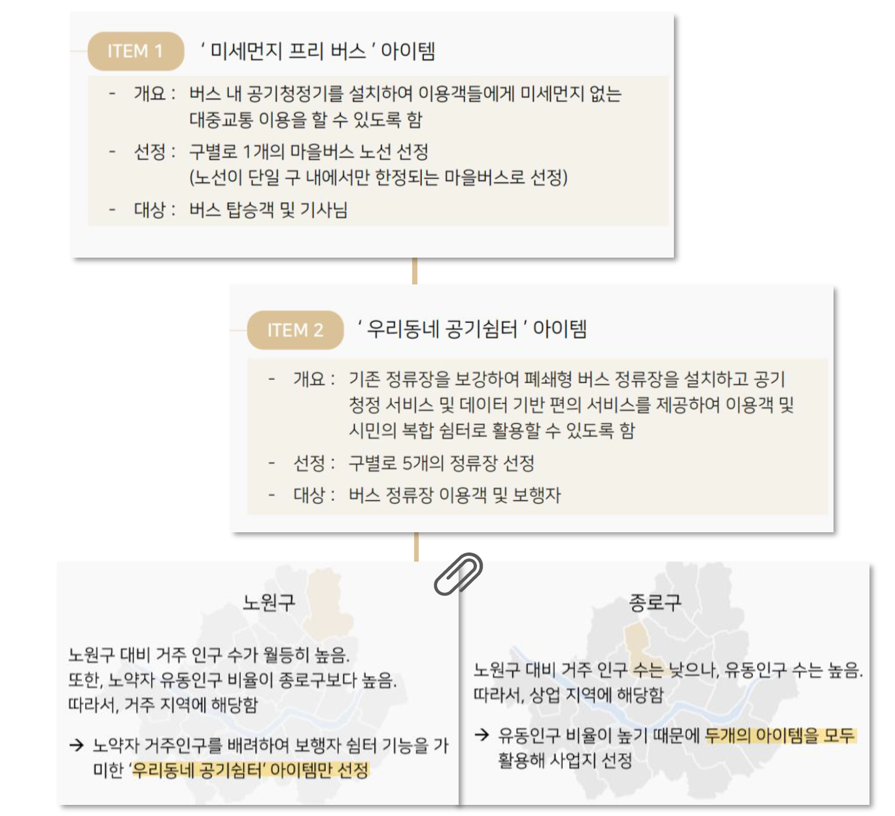

# 서울특별시 청정 버스 노선 및 정류소 사업 제안
2019 빅콘테스트 공모전 Innovation 분야 최우수상 수상작 

## Goal 
#### **미세먼지의 사회적 영향 분석 및 비즈니스 아이디어 제시**  
빅데이터를 활용한 미세먼지로 인한 서울 시민의 사회, 경제적 행동 변화 및 비즈니스 아이디어 도출  

### Overview
서울시 노원구와 종로구의 미세먼지, 유동인구 및 교통 관련 데이터를 바탕으로 최적 노선 및 정류소 제시  

**[Problem]**  
미세먼지 농도가 높은 날에도 대중교통을 이용해야 하는 **시민들의 건강한 호흡을 보장**할 수 있는 서비스를 제공해야 함

**[Solution]**  
시민의 관심도를 고려해 가장 파급력 있게 사업 효과를 낼 수 있는 **공기청정시설을 버스 내부와 정류장에 설치**  

**[Key point]**
- 사업지 선정에 앞서 미세먼지로 인한 서울 시민의 행동에 대한 연구 가설을 세우고 이를 증명해 사업의 필요성을 강조함
- 시범 사업지인 노원구와 종로구의 특성을 고려해 지역 맞춤 사업 아이템을 제안함

- - -

### Timeline
2019.08 ~ 2019.09

### Team
역삼동 불주먹 / 강승연, 서소미, 조유민

### Role
- 미세먼지 및 유동인구 데이터 전처리 및 시각화(matplotlib, seaborn)
- 본 심사 시 발표 및 질의응답

### Presentation
[발표 자료](Innovation_이노베이션_역삼동불주먹팀_결과보고서.pdf)
